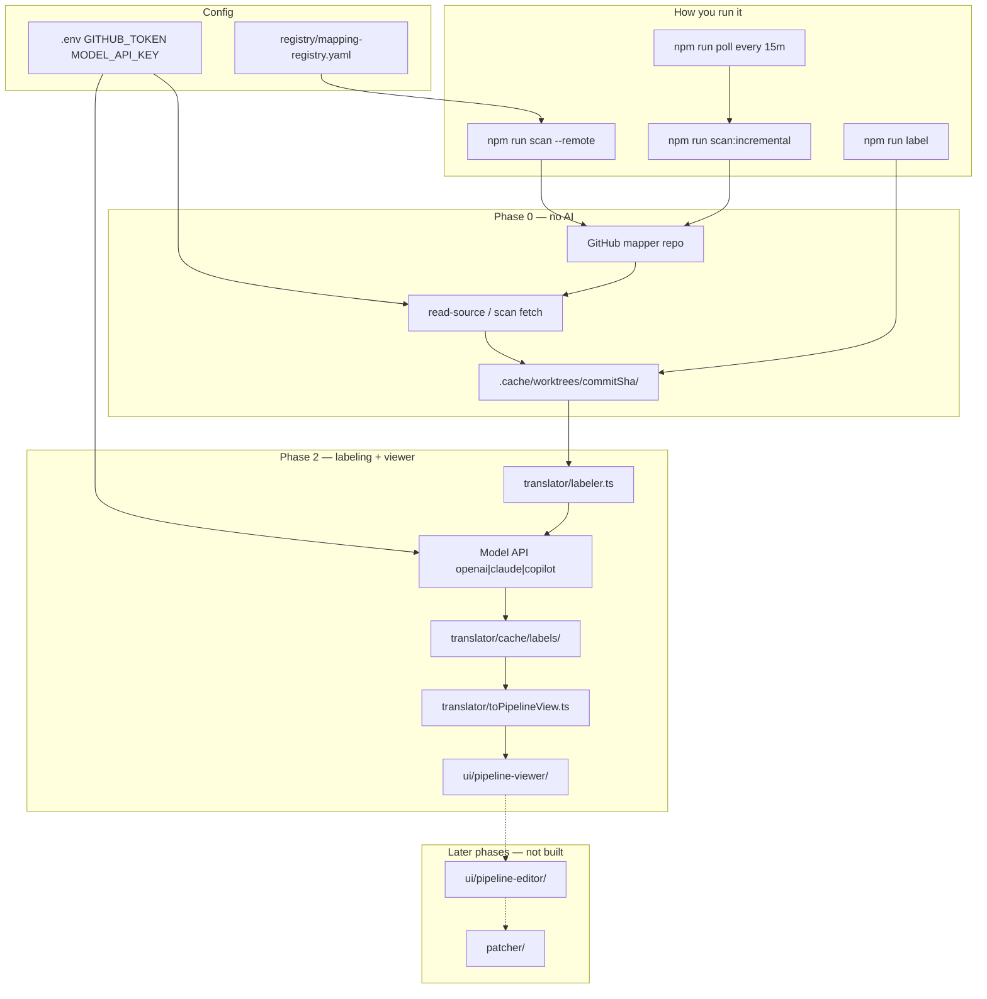

# Kodiak Agent — About

Orchestrator for viewing and proposing changes to prod Java mapping logic. Java classes in GitHub (or a local worktree) are the source of truth; this tool discovers and labels them — without migrating logic to a new framework.

It is **not** tied to a specific domain schema: any registered mapper + optional schema works. Configure `registry/mapping-registry.yaml` for your Java mapper repo.

---

## Core principle

**AI drives field discovery and business labeling.** Registry, GitHub fetch, and source resolution stay deterministic and non-AI; business users never get direct write access to prod code.


| Layer                              | AI?           |
| ---------------------------------- | ------------- |
| Registry, GitHub fetch             | No            |
| Discovery + business-path labeling | Yes (default) |
| Shadow tests, merge gates          | No            |


---


## Phase status


### Phase 0 — Foundations — **Complete**

- [x] Mapping registry (`registry/mapping-registry.yaml`) — repo, branch, scope, mapper entries
- [x] Golden test harness stub (`validator/golden-dataset/capture.ts`) — N sample input/output fixtures
- [x] GitHub connector read-only (`src/mcp/githubClient.ts`) — REST + optional MCP; public repo works without token


### Phase 1 — Source fetch & cache — **Complete**

- [x] GitHub / worktree fetch → `.cache/worktrees/{commitSha}/`
- [x] Cache keyed by `(commit SHA, file hash)` / `filePath:blobSha` (`src/cache/index.ts`)
- [x] Scan orchestrator (`src/orchestrator/scanRepo.ts`) — fetch → cache
- [x] Incremental re-fetch (`src/orchestrator/incrementalScan.ts`) — only changed in-scope files
- [x] Poll cron (`src/poll/cron.ts`, 15 min) — webhooks deferred


### Phase 2 — Read-only visualization — **Complete (v0)**

- [x] AI discovery → labeled pipeline JSON (`translator/model/`)
- [x] Model provider labeling (`translator/model/provider.ts`, openai|claude|copilot styles)
- [x] Translation cache by content hash (`translator/cache/`)
- [x] Step-type schema stub (`translator/schema/step-types.json`)
- [x] UI mock spec (`mock/field-mapper-builder.html`) — reference only, not wired to live data
- [x] Pipeline adapter (`translator/toPipelineView.ts`) — backend JSON → mock step cards
- [x] `ui/pipeline-viewer/` — read-only viewer loading exported `.view.json`
- [x] No write-back in viewer (read-only Phase 2)


### Phase 3 — Editing & patch generation — **Not started**

- [ ] Pipeline editor UI
- [ ] Diff engine (pipeline edit → minimal Java patch)
- [ ] PR bot via GitHub MCP


### Phase 4 — Validation gate — **Not started**

- [ ] Shadow test runner (old vs patched Java, golden dataset)
- [ ] CI MCP integration
- [ ] Hard merge block on unintended field changes


### Phase 5 — Reproducibility & audit — **Partial**

- [x] Model pinned (`MODEL_NAME`), temperature `0`
- [x] Label cache by `(model, sourceText)` hash
- [ ] Full audit log (`audit/log-store.ts`)


### Phase 6 — Rollout — **Not started**

- [ ] Canary mappers, metrics, registry expansion

---


## Current flow (what exists today)



**Text summary:**

```
GitHub (mapper repo)
    ↓  npm run scan --remote
Fetch to .cache/worktrees/{sha}/
    ↓  npm run label
AI discovers fields → model labels → pipeline JSON
    ↓  npm run view:export --label
Pipeline view JSON → ui/pipeline-viewer/
    ↓  npm run view:serve
Business user views pipeline (read-only)
```


### Registered mappers


| ID                           | Source file                                      |
| ---------------------------- | ------------------------------------------------ |
| `demo-ai-recognition-mapper` | `DemoAiRecognitionMapper.java` — small canary |


---


## Commands

```bash
npm install

# GitHub
npm run latest-sha
npm run scan -- --mapper demo-ai-recognition-mapper --remote
npm run scan:incremental
npm run poll

# Label
npm run label -- --mapper demo-ai-recognition-mapper

# Golden fixtures (Phase 0)
npm run golden:capture
```

---


## Configuration (`.env`)


| Variable                | Purpose                                                         |
| ----------------------- | --------------------------------------------------------------- |
| `GITHUB_TOKEN`          | Optional for public repo; recommended for polling (5000 req/hr); also used by `copilot` style |
| `MODEL_API_KEY`         | Used by `npm run label` (or `ANTHROPIC_API_KEY` / `COPILOT_TOKEN`). Not required — if missing, or if the API call fails (e.g. blocked office network), `label` auto-falls-back to an offline agent job (see below) |
| `MODEL_API_STYLE`       | `openai` \| `claude` \| `copilot`                               |
| `MODEL_NAME`            | Model id (e.g. `gpt-4o`, `claude-sonnet-4-5`)                   |
| `POLL_INTERVAL_MINUTES` | Default `15`                                                    |

### No model API access? (offline agent jobs)

`npm run label` detects when it can't reach the model API and instead exports an offline
job (`.cache/agent-jobs/{mapperId}/{fingerprint}/job.json`) with clear next steps printed
to the console — open `job.json` in VS Code, ask Copilot Chat (agent mode) to complete it
(`.github/instructions/kodiak-agent-label.instructions.md` auto-attaches for that path and
tells the agent exactly how to write `result.json`), then run `npm run label:import` and
`npm run label -- --from-cache-only`. See `translator/agent/exportJob.ts` /
`translator/agent/importJob.ts` and the "Offline mode" section in `README.md`.

---


## Project layout

```
kodiak-agent/
├── registry/mapping-registry.yaml   # what to scan
├── src/                             # orchestration, MCP, cache, scan
├── translator/                      # Model labeling (Phase 2)
├── validator/golden-dataset/        # ground-truth fixtures
├── mock/field-mapper-builder.html   # UI spec (not connected yet)
├── mcp-config/                      # GitHub MCP read-only config
└── ui/                              # pipeline viewer/editor (deferred)
```

---


## Backend JSON vs mock UI

The labeler outputs **business** JSON keyed by `mapperId` + `mapping`, using schema paths (e.g. `DeliveryPayload.fullName`) with a `pipeline` of ops (`READ`, `TRANSFORM`, `CONSTANT`, …). The mock HTML expects **business-centric** steps (`kind`, `field`, `target`, `op`, `rows`). A pipeline adapter and viewer app bridge the two.

See [README.md](./README.md) for setup and [CLAUDE.md](./CLAUDE.md) for phase boundaries.

---


## Deliberately deferred

- GitHub App (PAT sufficient for one public repo)
- Webhooks (poll first)
- Registry auto-discovery
- PR write scope / patch bot
- Postgres (file cache for v0)
