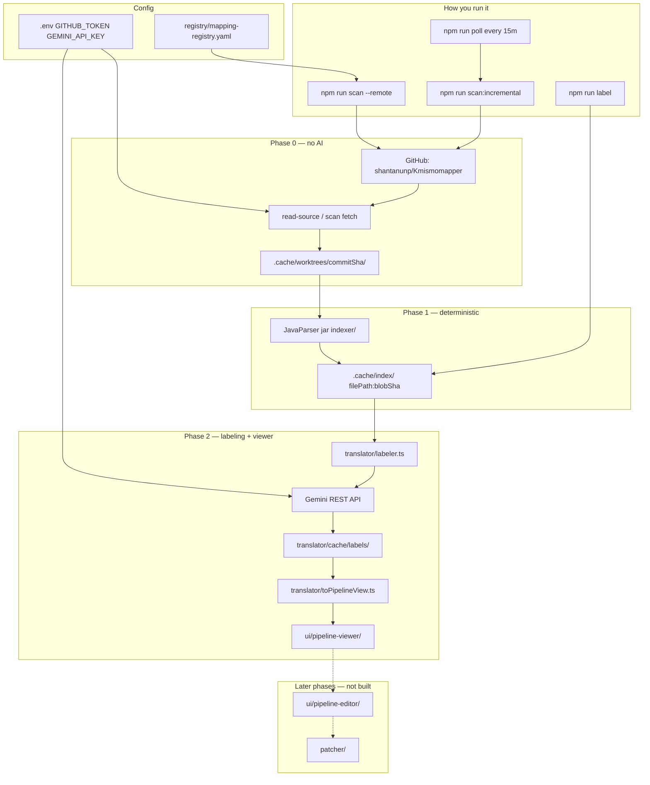

# Kodiak Agent — About

Orchestrator for viewing and proposing changes to prod Java mapping logic. Java classes in GitHub are the source of truth; this tool discovers, indexes, and labels them — without migrating logic to a new framework.

**Target repo:** [shantanunp/Kmismomapper](https://github.com/shantanunp/Kmismomapper) (public)

---

## Core principle

**AI only touches translation/suggestion.** Discovery, parsing, and verification stay deterministic and test-gated. Business users never get direct write access to prod code.


| Layer                                      | AI?         |
| ------------------------------------------ | ----------- |
| Registry, GitHub fetch, JavaParser indexer | No          |
| Gemini labeling of parsed steps            | Labels only |
| Shadow tests, merge gates                  | No          |


---


## Phase status


### Phase 0 — Foundations — **Complete**

- [x] Mapping registry (`registry/mapping-registry.yaml`) — repo, branch, scope, mapper entries
- [x] Golden test harness stub (`validator/golden-dataset/capture.ts`) — N sample input/output fixtures
- [x] GitHub connector read-only (`src/mcp/githubClient.ts`) — REST + optional MCP; public repo works without token


### Phase 1 — Discovery & Indexing — **Complete**

- [x] JavaParser static indexer (`indexer/`) — deterministic AST walk, `RAW` for unclassified constructs
- [x] Cache keyed by `(commit SHA, file hash)` / `filePath:blobSha` (`src/cache/index.ts`)
- [x] CLI `index-mappings` (`indexer/cli.ts`, `npm run index-mappings`)
- [x] Scan orchestrator (`src/orchestrator/scanRepo.ts`) — fetch → index → cache
- [x] Incremental re-scan (`src/orchestrator/incrementalScan.ts`) — only changed in-scope files
- [x] Poll cron (`src/poll/cron.ts`, 15 min) — webhooks deferred


### Phase 2 — Read-only visualization — **Complete (v0)**

- [x] AST → labeled pipeline JSON (`translator/labeler.ts`)
- [x] Gemini REST labeling for `RAW` steps only (`translator/geminiProvider.ts`, Google AI Studio)
- [x] Translation cache by content hash (`translator/cache/`)
- [x] Step-type schema stub (`translator/schema/step-types.json`)
- [x] UI mock spec (`mock/field-mapper-builder.html`) — reference only, not wired to live data
- [x] Pipeline adapter (`translator/toPipelineView.ts`) — backend JSON → mock step cards
- [x] `ui/pipeline-viewer/` — read-only viewer loading exported `.view.json`
- [x] No write-back in viewer (read-only Phase 2)


### Phase 3 — Editing & patch generation — **Not started**

- [ ] Pipeline editor UI
- [ ] Diff engine (pipeline edit → minimal Java patch)
- [ ] PR bot via GitHub MCP


### Phase 4 — Validation gate — **Not started**

- [ ] Shadow test runner (old vs patched Java, golden dataset)
- [ ] CI MCP integration
- [ ] Hard merge block on unintended field changes


### Phase 5 — Reproducibility & audit — **Partial**

- [x] Model pinned (`GEMINI_MODEL`), temperature `0`
- [x] Label cache by `(model, sourceText)` hash
- [ ] Full audit log (`audit/log-store.ts`)


### Phase 6 — Rollout — **Not started**

- [ ] Canary mappers, metrics, registry expansion

---


## Current flow (what exists today)



**Text summary:**

```
GitHub (Kmismomapper)
    ↓  npm run scan --remote
Fetch to .cache/worktrees/{sha}/
    ↓  JavaParser jar
AST JSON (WRITE, FILTER, RAW, …) → .cache/index/
    ↓  npm run label  (optional)
Gemini labels RAW steps → pipeline JSON
    ↓  npm run view:export --label
Pipeline view JSON → ui/pipeline-viewer/
    ↓  npm run view:serve
Business user views pipeline (read-only)
```


### Registered mappers


| ID                           | Source file                                      |
| ---------------------------- | ------------------------------------------------ |
| `demo-ai-recognition-mapper` | `DemoAiRecognitionMapper.java` — small canary    |
| `lpa-request-mapper`         | `LpaRequestMapper.java` — full LPA/MISMO mapping |


---


## Commands

```bash
npm install
npm run build:indexer

# GitHub
npm run latest-sha
npm run scan -- --mapper demo-ai-recognition-mapper --remote
npm run scan:incremental
npm run poll

# Index + label
npm run index-mappings -- --mapper demo-ai-recognition-mapper
npm run label -- --mapper demo-ai-recognition-mapper

# Golden fixtures (Phase 0)
npm run golden:capture
```

---


## Configuration (`.env`)


| Variable                | Purpose                                                         |
| ----------------------- | --------------------------------------------------------------- |
| `GITHUB_TOKEN`          | Optional for public repo; recommended for polling (5000 req/hr) |
| `GEMINI_API_KEY`        | Google AI Studio — required for `npm run label`                 |
| `GEMINI_MODEL`          | Default `gemini-flash-latest`                                   |
| `GEMINI_TEMPERATURE`    | Default `0`                                                     |
| `POLL_INTERVAL_MINUTES` | Default `15`                                                    |


---


## Project layout

```
kodiak-agent/
├── registry/mapping-registry.yaml   # what to scan
├── indexer/                         # JavaParser sidecar (no AI)
├── src/                             # orchestration, MCP, cache, scan
├── translator/                      # Gemini labeling (Phase 2)
├── validator/golden-dataset/        # ground-truth fixtures
├── mock/field-mapper-builder.html   # UI spec (not connected yet)
├── mcp-config/                      # GitHub MCP read-only config
└── ui/                              # pipeline viewer/editor (deferred)
```

---


## Backend JSON vs mock UI

The labeler outputs **Java-centric** steps (`kind`, `targetField`, `sourceField`, `sourceText`). The mock HTML expects **business-centric** steps (`kind`, `field`, `target`, `op`, `rows`). A pipeline adapter and viewer app (Phase 2 remaining work) will bridge the two.

See [README.md](./README.md) for setup and [CLAUDE.md](./CLAUDE.md) for phase boundaries.

---


## Deliberately deferred

- GitHub App (PAT sufficient for one public repo)
- Webhooks (poll first)
- Registry auto-discovery
- PR write scope / patch bot
- Postgres (file cache for v0)

