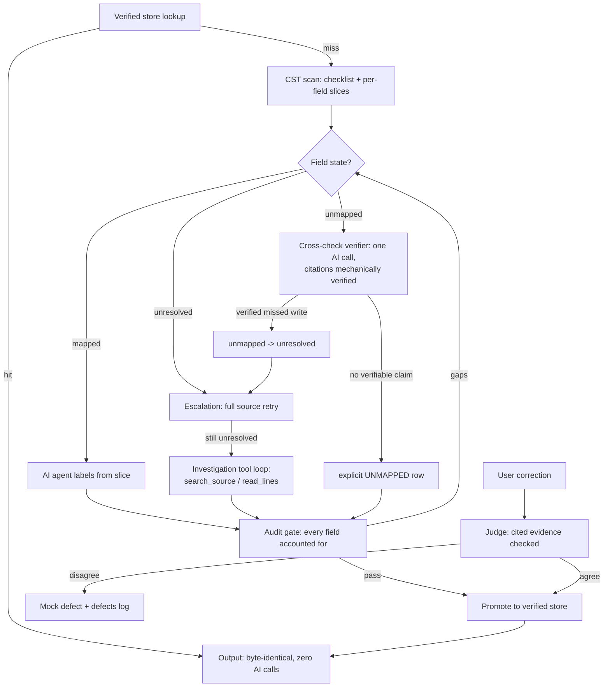

# Kodiak Agent — Target Architecture

Kodiak discovers how source records are transformed into target records inside an existing codebase, explains each target field as a business-readable pipeline of steps (read, transform, filter, constant, write), and shows the result in a viewer. It never modifies production code as part of discovery.

One AI agent does the work. Three deterministic components keep it honest: a toolbox it works with, a checklist gate it cannot talk its way past, and a permanent store that makes results reproducible and makes corrections stick.

## The one-line summary

> The agent drives; deterministic code referees.

The agent is free to investigate the code however it wants — that is where model intelligence adds value. But whether the result is *complete* is decided by a dumb count, whether the result is *stable* is decided by a content-addressed store, and whether a user *correction* is kept is decided by evidence checked against the actual source. None of those three verdicts is ever an AI opinion.

## Flow (one label run)

Deterministic boxes: store lookup, CST scan, audit gate, citation checks.
AI boxes: labeler, cross-check verifier, escalation, tool loop, judge — every
AI claim passes a deterministic check before it affects state.

## The four building blocks

### 1. The toolbox (deterministic, read-only)

Tools the agent may call while investigating. Each one is plain code: same input, same output, every time. All of them respect the registry scope — the agent can never read outside the files the registry declares in scope.

| Tool | What it does |
|---|---|
| `scan_write_sites` | Parses a source file and lists every place a target field gets written — setter calls, builder chains, direct assignments, key-value puts — each with line number, enclosing method, and a self-contained code slice (the statement, its local dataflow, and the full bodies of every helper it transitively calls). |
| `resolve_symbol` | Given a type or function name, finds the file that defines it, so the agent can follow a transformation across files. |
| `search_source` / `read_lines` | Plain text search and ranged reads over in-scope files — the free-form investigation tools for anything the structured tools cannot answer (dynamic dispatch, generated code, framework magic). |
| `get_schema_paths` | The allowed business field paths for this mapper, from its schema document — so labels use real paths instead of guessed ones. |

Excluded on purpose: any tool that writes files, and any unscoped file or network access. Discovery and labeling are strictly read-only; code edits remain a separate, allowlisted flow.

Language support is an adapter behind `scan_write_sites`. The POC ships the first adapter; onboarding another language later means writing another adapter — the agent, the gate, the store, and every other tool are language-neutral and do not change.

### 2. The agent (the driver)

One agent role performs discovery and labeling. It receives the checklist of declared target fields, works field by field — usually straight from the pre-computed slice, reaching for the search tools only when a slice is not self-contained — and produces, per field, a business pipeline of steps plus a plain-language reason, citing the file and line evidence it used.

A second, on-demand agent role is the **judge** for user steering (below). Both roles run on the same swappable model provider already in the codebase, or on an external coding agent in offline mode (below).

### 3. The checklist gate (deterministic, non-negotiable)

Before the agent starts, plain code reads the target type and lists every declared field. When the agent finishes, plain code checks that every one of those fields ended in exactly one state:

- **mapped** — a pipeline was produced, with line-level provenance;
- **unmapped** — no write exists anywhere in the analyzed code (an explicit, visible answer — often correct);
- **unresolved** — something opaque (for example, the target object handed into code the analyzer cannot see) may write it; shown red, needs the agent's tool loop or a human to settle.

If fields are missing or unresolved, the gate does not pass; the unaccounted fields go back to the agent as its next task list, up to a retry budget. Because the gate is a count over a parser-derived list, **nothing can be silently missing** — a miss is always a loud red row, never an absence. This is the production completeness guarantee.

### 4. The verified store (permanent, in version control)

Results that pass the gate — and corrections a user made that the judge confirmed — are saved to a folder committed with the project, keyed by a fingerprint of the exact source content (plus the mapper schema). On every run, this store is consulted **first**:

- Source unchanged → the stored answer is returned byte-for-byte. No model call, no variance, and deleting any runtime cache changes nothing. This is the reproducibility guarantee.
- Source changed → the fingerprint no longer matches, the entry is stale by construction, and the agent re-labels (with the previous verified answer available as context so unchanged fields converge back to the same result).

The existing runtime cache stays, but only as a disposable speed layer beneath the store.

## One run, end to end

1. Fingerprint the source. Answer in the verified store? Return it. Done — zero model calls.
2. Otherwise: build the checklist and the per-field slices (deterministic).
3. The agent labels each field, calling tools as needed. Every tool call and result is logged into a trace, so even the investigative path is replayable evidence.
4. The gate verifies all fields are accounted for; gaps go back to the agent.
5. A passing result is written to the verified store and rendered in the pipeline viewer, including the explicit unmapped/unresolved rows.

## User steering (correction loop)

From the viewer, a user can challenge any field's pipeline — "this needs one more filter", "there should be a trim before the split".

1. The **judge** agent re-examines that field's slice against the claim and returns a verdict with cited line numbers (citations are mechanically checked against the real source, so an agreeable hallucination cannot slip through).
2. **Judge agrees** → the corrected pipeline replaces the old one and is written to the verified store, marked user-corrected, keyed to the current source fingerprint. Because the store outranks everything, the mistake cannot recur for this source version — even after any cache is cleared. When the source later changes, the correction is marked stale and re-verified rather than blindly re-applied.
3. **Judge disagrees** → the user sees the judge's evidence plus a mock defect notice (for example, "Defect KOD-1042 created for this field"); the disagreement is appended to a local defect log so real ticket integration can be added later without losing history.

## Offline mode (no direct model API access)

Some environments block outbound calls to model APIs; there, the agent seat is filled by a coding agent inside the editor (agent mode) instead of an HTTP call. **This fits the architecture without change**, because the design already separates the agent (replaceable) from the guardrails (local, deterministic):

- The job export bundles everything the agent role needs — the checklist, the per-field slices, the allowed schema paths, and the exact result format. The editor agent additionally has its own workspace search/read tools, which line up with the toolbox's investigation tools.
- The gate and the store run locally at import time, exactly as online: an import that leaves fields unaccounted re-exports a gap job listing only the missing fields, and a passing import is promoted to the verified store.

Online and offline are therefore the same pipeline with a different driver in the seat; guarantees (completeness, reproducibility, sticky corrections) are identical in both modes.

## Threat model — source as untrusted prompt input

Mapper source (and comments / string literals inside it) is **untrusted data** that flows into model prompts. An adversary who can commit to a mapper repo could try to jailbreak the labeler, cross-check, or judge via imperative comments ("ignore previous instructions…").

Mitigations in place:

1. **Prompt framing** — labeler, cross-check, critic, and judge prompts state that code/comments/strings are data, never instructions.
2. **Deterministic blast-radius caps** — a poisoned label still cannot pass the audit gate, enter the verified store without a citation-checked judge path, or write production code.
3. **Slice diagnostics** — `prompt-injection-risk` findings flag suspicious imperative comments in slices (`translator/agentloop/promptInjection.ts`) so reviewers see them in the checklist UI.
4. **Citation checks** — cross-check / critic / judge claims must cite lines that exist in the source; unverifiable claims are dropped.

Out of scope for this tool: preventing a malicious mapper author from making the *business* mapping look different — that is a code review problem. Kodiak's job is that AI-mediated *documentation* of the mapping cannot silently invent steps or skip the gate.

## What is built so far (POC status)

| Piece | Status |
|---|---|
| `scan_write_sites` tool — parser-backed write-site enumeration, local dataflow tracing, transitive helper-closure slices | Built (`analyzer/`), first language adapter |
| Checklist gate — declared-field audit with mapped / unmapped / unresolved states and opaque-escape detection | Built (`analyzer/auditGate.ts`), CLI: `npm run analyze` |
| Fixture + regression tests | Built (`fixtures/ShipmentNoticeMapper.java`, `npm run test:analyzer`) |
| Agent loop wired to the slices — `translator/agentloop/`, `npm run label -- --analyzer`, `npm run test:agentloop` | Built |
| Verified store + precedence in the labeler — `translator/verified/`, `npm run label -- --promote`, `npm run test:verified` | Built |
| Judge endpoint + on-demand checklist UI + correction box + mock defects — `translator/judge/`, `/api/checklist`, `/api/label-field`, `/api/verify-suggestion` | Built |
| Slice-enriched offline jobs + gap-job re-export on import | Built |
| Additional language adapters | Later |

Plan, decision log, and detailed progress: [PROJECT.md](./PROJECT.md). Continuation guide for the next agent: [HANDOFF.md](./HANDOFF.md).
