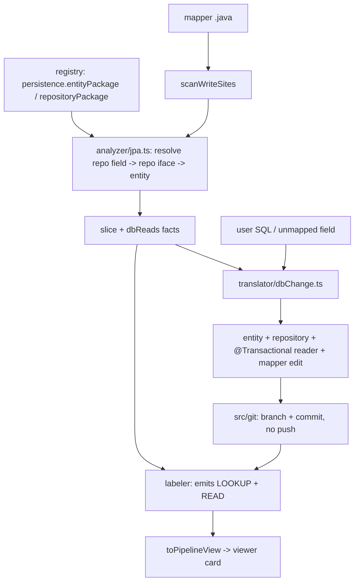

# Database reads as a first-class LOOKUP op

Status: **planned, not started.** Captured 2026-08-09.

Add Spring Data JPA database reads to Kodiak as a first-class `LOOKUP` pipeline op: the
deterministic analyzer resolves repository/entity sources, the labeler emits `LOOKUP` steps, and a
new patch generator creates entity/repository/reader classes on a git branch. Kodiak still never
connects to a database — it only reads and writes Java, exactly as it does for pure data
transformation today.

Three driving scenarios:

1. A column is read from the DB and set on the target DTO — show it in the pipeline.
2. Change an existing mapping given a SQL query — create the repository and entity if absent, then
   patch the code.
3. An unmapped target field — create a new DB mapping for it (repository, entity, read, and set).

## Verdict on "without architecture change"

Yes for the architecture, no for "already works". Every architectural invariant in `CLAUDE.md`
survives: DB discovery is deterministic and lives in `analyzer/`, the AI stays in `translator/`,
GitHub stays read-only. But three concrete blockers exist today:

- `collectClosure` in [analyzer/scanWriteSites.ts](analyzer/scanWriteSites.ts) only resolves
  cross-file calls via `qualifiedCalls`, whose regex is `/(?<![\w.])([A-Z]\w*)\.(\w+)\s*\(/` — an
  uppercase receiver. An injected `orderRepository.findByOrderNumber(...)` matches neither that nor
  the bare-helper regex, so the repository and entity are never pulled into the slice. The call text
  does reach the model via `traceLocalDefs`, just with no definition behind it.
- There is no DB-aware op, so the model can only answer `read` (renders as `Field x`,
  indistinguishable from a DTO getter) or `raw` (renders "Could not classify automatically").
- `resolveAllowedPaths` in [translator/applyChange.ts](translator/applyChange.ts) allowlists exactly
  `mapper.sourceFile` and `mapper.goldenTests` and skips non-existent files, so no new
  entity/repository/reader class can ever be written.

`registry/mapping-registry.yaml` already declares a `persistence` block that no TypeScript reads —
`MapperEntry` in [src/registry/loadRegistry.ts](src/registry/loadRegistry.ts) doesn't declare it.
Making it real is step one.

## Flow



## Part A — Scenario 1: discover and show DB reads

**1. Make `persistence` load.** Add to `MapperEntry`:

```ts
export interface MapperPersistence {
  framework: "spring-boot-jpa";
  entityPackage: string;
  repositoryPackage: string;
  /** New: where generated @Transactional reader classes go. */
  lookupPackage?: string;
}
```

Add resolution warnings to [src/registry/checkRegistry.ts](src/registry/checkRegistry.ts) following
the existing `sourceType-unresolved` pattern.

**2. New `analyzer/jpa.ts`** (deterministic, no model calls):

- `findRepositoryFields(parsed)` — instance fields whose type ends in `Repository` or resolves under
  `repositoryPackage`, covering `@Autowired`, constructor-injected, and `final` fields.
- `resolveDbRead(receiver, method, worktree, persistence)` — receiver name to declared type to
  `findTypeFile` to the repository interface, then the entity from its `JpaRepository<E, ID>` type
  argument.
- Emit a `DbReadFact { repositoryClass, method, entityClass, entityFile, queryAnnotation?,
  derivedFromName, columns }`. Spring Data derived queries have no method body, so the semantics are
  the method name plus the entity's `@Table`/`@Column` annotations — inline the entity source and
  the repository method signature, not a body.

**3. Wire it into slicing.** In [analyzer/scanWriteSites.ts](analyzer/scanWriteSites.ts), add an
`instanceCalls()` pass beside `qualifiedCalls()` inside `collectClosure`, and append a `// db read:`
fact block to `sliceText`. Add `dbReads?: DbReadFact[]` to `WriteSlice` in `analyzer/types.ts`.

**4. Add the LOOKUP op.**

- `"LOOKUP"` into `CANONICAL_STEP_KINDS` in
  [translator/model/applyResponse.ts](translator/model/applyResponse.ts); `"lookup"` (and the
  missing `"constant"`) into [translator/schema/step-types.json](translator/schema/step-types.json).
- `fromPipelineOp` maps `{kind:"lookup", entity, repository, method, key}` into `meta`.
- Extend `FIELD_MAPPING_PROMPT` in
  [translator/model/provider.ts](translator/model/provider.ts): when the slice carries a
  `// db read:` block, emit `lookup` then `read`, where the read's `sourceField` is an entity column
  path. Keep the existing "no Java package prefixes in field paths" rule for DTO paths, but allow
  the entity simple name as a namespace (`OrderSubmission.stateName`).
- **Bump `PIPELINE_CACHE_VERSION`** — otherwise cached labels mask the whole change.

**5. Grounding.** In [translator/agentloop/grounding.ts](translator/agentloop/grounding.ts), add a
`LOOKUP` branch requiring `meta.repository` and `meta.method` to appear in `sliceText`, and let
entity-column READs ground against `dbReads` columns instead of only `schemaPaths`.

**6. Viewer.** Add `"lookup"` to `ViewStepKind` and a `convertStep` branch in
[translator/toPipelineView.ts](translator/toPipelineView.ts); add `ICONS`/`LABELS`/`BG`/`COLOR`
entries plus `renderStepBody` and `summarize` cases in
[ui/pipeline-viewer/index.html](ui/pipeline-viewer/index.html), rendering as "Look up
`OrderSubmission` by `orderNumber` via `findByOrderNumber`".

## Part B — Scenarios 2 and 3: generate the patch

**7. Replace the fixed allowlist with a policy.** Rewrite `resolveAllowedPaths` so it returns
editable paths (`sourceFile`, `goldenTests`, must exist) plus creatable path *prefixes* (the entity,
repository, and lookup package directories). Keep the existing `abs.startsWith(root + sep)` escape
check on every path, and permit creation only under the creatable prefixes.

**8. New `translator/dbChange.ts`**, a sibling of `applyChange.ts` rather than an overload of it:

- Deterministic pre-pass: parse the supplied SQL for table, columns, and where-clause params; use
  `analyzer/jpa.ts` + `findTypeFile` to decide reuse-vs-create for the entity and the repository
  method.
- Model call producing full file contents for only the missing pieces plus the mapper edit.
- **Transaction boundary is a hard post-check, not just a prompt rule**: reject the patch if
  `@Transactional` appears anywhere in `mapper.sourceFile`. The annotation belongs solely on the
  generated reader class in `lookupPackage`, which the mapper calls. This keeps the transformation
  itself non-transactional.
- Scenario 3 (currently-unmapped field) is the same path with the target field's audit state
  pre-filled from `runAuditGate`.

**9. Git branch and commit** — new `src/git/worktreeCommit.ts` (in `src/`, so it stays deterministic
and AI-free): `checkout -b kodiak/<mapperId>/<field>-<shortHash>`, stage only Kodiak-written files,
commit, never push. `mcp-config/github.json` stays read-only.

**10. Endpoint and UI.** `POST /api/db-change` in [ui/serve.ts](ui/serve.ts) beside
`/api/apply-change`; the viewer's AI box grows an SQL textarea when the selected field is unmapped
or already DB-backed. After committing, re-run analyzer plus labeler for that field so the new
LOOKUP card appears — that is the proof the patch did what was asked.

## Task list

- [ ] Load the persistence block: add `MapperPersistence` to `MapperEntry` in
      `src/registry/loadRegistry.ts` and resolution warnings in `src/registry/checkRegistry.ts`
- [ ] Add `analyzer/jpa.ts` to resolve injected repository fields to repository interfaces and JPA
      entities, emitting `DbReadFact` records
- [ ] Extend `collectClosure` in `analyzer/scanWriteSites.ts` with lowercase instance-receiver
      resolution and append a `// db read:` fact block to `sliceText`
- [ ] Add `LOOKUP` to `CANONICAL_STEP_KINDS`, `step-types.json`, and `fromPipelineOp`; extend
      `FIELD_MAPPING_PROMPT` and bump `PIPELINE_CACHE_VERSION`
- [ ] Add LOOKUP grounding and entity-column READ grounding to `translator/agentloop/grounding.ts`
- [ ] Render the lookup step in `translator/toPipelineView.ts` and `ui/pipeline-viewer/index.html`
- [ ] Add a DB-backed mapper fixture in `ktransform` to develop and test against
- [ ] Replace `resolveAllowedPaths` with an editable-paths plus creatable-prefixes policy,
      preserving the worktree escape check
- [ ] Build `translator/dbChange.ts`: SQL pre-pass, reuse-vs-create decision, file generation, and
      the hard `@Transactional`-not-in-mapper post-check
- [ ] Add `src/git/worktreeCommit.ts` to create a `kodiak/` branch and commit only Kodiak-written
      files, no push
- [ ] Add `POST /api/db-change` to `ui/serve.ts` plus the SQL input in the viewer, and re-label the
      field after commit
- [ ] Register new tests in the test scripts and update the `ABOUT.md` phase table

## Notes and follow-ups

- Offline mode is out of scope as written. `AgentJob` in
  [translator/agent/types.ts](translator/agent/types.ts) inlines only `sourceJava` and `schemaJson`;
  scenario 1 offline needs entity/repository source added to the job, and scenarios 2 and 3 offline
  would need a new job kind. Decide before starting whether the blocked-office-network case must
  work from day one.
- New test files must be listed explicitly in the `test:translator` / `test:analyzer` scripts —
  there is no glob discovery.
- `ABOUT.md`'s phase table needs updating; it still says Phase 3 is not started while
  `applyChange.ts` already ships a scoped POC.
- `ktransform` has no DB-reading mapper yet, so a fixture is needed to develop against — either a
  small `@Transactional` reader wired into `OrderRequestMapper`, or a new registered mapper over the
  existing `OrderSubmissionRepository`.
