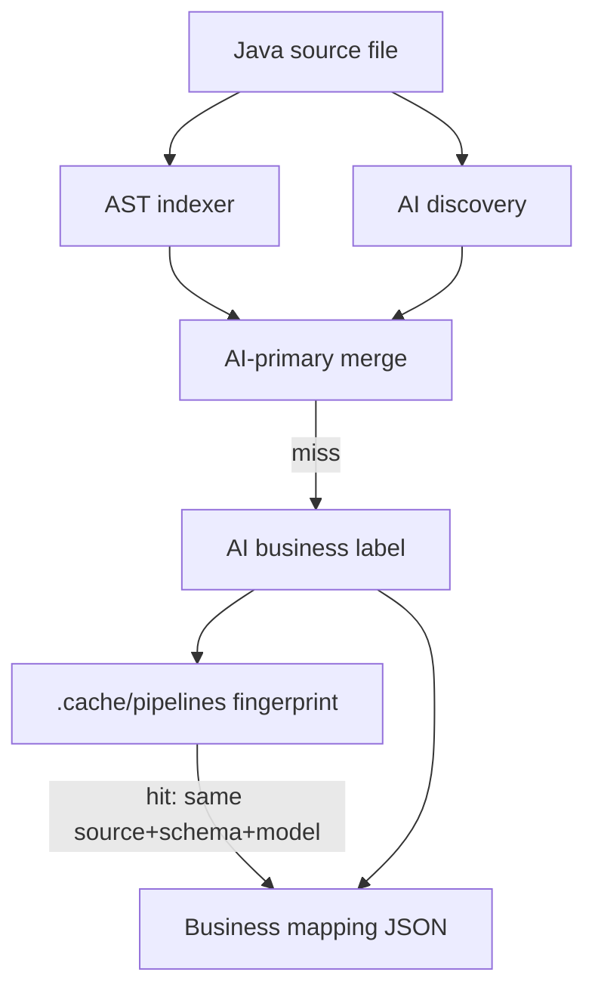

# Kodiak Agent

Orchestrator for Java mapping discovery, indexing, and pipeline visualization.

**Target mapping repo:** [shantanunp/Kmismomapper](https://github.com/shantanunp/Kmismomapper) (public)

## Quick start

```bash
cp .env.example .env          # MODEL_API_KEY required for label; GITHUB_TOKEN optional
npm install
npm run build:indexer         # JavaParser shadow jar (needs JDK 21 — see note below)
```

Two independent commands (do not need to run both):


| Command         | Role                                                       | AI? |
| --------------- | ---------------------------------------------------------- | --- |
| `npm run ast`   | Deterministic Java AST (Java DTO paths; corroboration)     | No  |
| `npm run label` | AI-primary discovery → business paths (`--with-ast` optional) | Yes |


```bash
# 1) AST only — local checkout, no AI
npm run ast -- --mapper lpa-request-mapper \
  --worktree /home/shantanu/Workspace/vscode/Kmismomapper

# 2) AI label — remote GitHub, or local worktree for unpushed mapper changes
npm run label -- --mapper lpa-request-mapper --remote

npm run label -- --mapper lpa-request-mapper \
  --worktree /home/shantanu/Workspace/vscode/Kmismomapper

npm run label -- --mapper lpa-request-mapper \
  --worktree /home/shantanu/Workspace/vscode/Kmismomapper \
  --fields MESSAGE.DEAL.PARTY.FirstName,MESSAGE.DEAL.PARTY.FullName
```

Prefer business `--fields` paths (`MESSAGE.…`). Leaf names and Java paths also match for filtering.

`npm run label` output is AI-owned business JSON: `mapperId` + `mapping` (schema paths like `MESSAGE.DEAL.PARTY.FirstName`, `applicant.displayName`) — no Java DTO envelope. `npm run ast` keeps Java paths for debugging.

Each `mapping` entry has a `pipeline` of ops (`READ`, `TRANSFORM`, `CONSTANT`, …). No `sourceText` / `children`.

After changing indexer Java, rebuild once: `npm run build:indexer`.

Registered mappers (see `registry/mapping-registry.yaml`):


| ID                           | File                           | Notes                                                      |
| ---------------------------- | ------------------------------ | ---------------------------------------------------------- |
| `demo-ai-recognition-mapper` | `DemoAiRecognitionMapper.java` | Small canary — best first check                            |
| `lpa-request-mapper`         | `LpaRequestMapper.java`        | LPA DTO mapper (helpers inlined; use `--fields` to filter) |

## Label pipeline



1. **AI discovery** — primary (default): finds target fields + code snippets (helpers inlined when they trim/split/etc.)  
2. **AST** — **off by default**; pass `--with-ast` to corroborate matches, raise `confidence` (`both` = 1, `ai` = 0.6), and enrich `meta.code`  
3. **Merge** — AI hits drive the labeling set; with `--with-ast`, AST-only targets are still not labeled (counted in `discoveryMeta.astOnly`)  
4. **Business label** — model rewrites to schema paths (`MESSAGE.*`)  
5. **Pipeline cache** — reuse until inputs change  

Escape hatch: `--with-ast --no-discover-ai` labels from AST only (`confidence` 0.4).

### Cache invalidation

Fingerprint = SHA-256 of:

- mapper `.java` source bytes  
- `registry/schemas/{mapperId}.schema.json` (or empty)  
- `GEMINI_MODEL`  
- `PIPELINE_CACHE_VERSION` (bumped when prompts/merge rules change)  

Caches under `.cache/`:

| Cache | When written | Purpose |
|-------|--------------|---------|
| `pipelines/` | Unfiltered `label` (no `--fields`) | Full business `mapping` |
| `fields/` | Every labeled field | Field-level business mapping — `--fields` warm → `"cacheHit": true` |
| `discovery/` | After AI discovery | Skip re-discovery when source unchanged |
| `translator/.../labels/` | Raw Gemini JSON per op | Micro-cache inside a field label |

```bash
# Use cache (default)
npm run label -- --mapper lpa-request-mapper --worktree /path/to/Kmismomapper

# Bypass cache for this run
npm run label -- --mapper lpa-request-mapper --worktree /path/to/Kmismomapper --no-cache

# Clear then run
npm run label -- --mapper lpa-request-mapper --worktree /path/to/Kmismomapper --clear-cache

# Clear all translator caches (pipelines + discovery + per-field labels)
npm run cache:clear
npm run cache:clear -- --mapper lpa-request-mapper
```

Unfiltered warm runs set `"cacheHit": true`. Filtered `--fields` runs reuse field cache when the fingerprint matches (`"cacheHit": true`).

**Discovery:** AI discovery is **on by default** (including with `--fields`). JavaParser AST is **off by default** — pass `--with-ast` to enable corroboration. AST-only labeling: `--with-ast --no-discover-ai`.


## Indexer build (local Gradle)

Uses your machine's `gradle` and `JAVA_HOME` (office artifactory / JDK). No Gradle Wrapper in-repo.

```bash
# requires JDK 17+ on PATH / JAVA_HOME, and `gradle` installed
npm run build:indexer
# or: cd indexer && gradle shadowJar
```


## Phase 0–1 scope (this delivery)

- `registry/mapping-registry.yaml` — scoped mapper list
- `indexer/` — JavaParser deterministic AST indexer (no AI)
- `validator/golden-dataset/` — ground-truth capture harness
- `src/mcp/githubClient.ts` — read-only GitHub via MCP + REST fallback
- `src/orchestrator/scanRepo.ts` — fetch → index → cache
- `src/orchestrator/incrementalScan.ts` — re-index changed files only
- `src/poll/cron.ts` — 15-minute poll (webhooks deferred)


## GitHub auth

Repo is **public** — unauthenticated reads work (60 requests/hour). For automated polling, add a fine-grained PAT with **Contents: Read-only** on [Kmismomapper](https://github.com/shantanunp/Kmismomapper):

```
GITHUB_TOKEN=ghp_...
```


## AI (Phase 2 — model provider)

Swap vendors via `.env` (see `translator/model/`):

```
MODEL_API_KEY=your-key
MODEL_API_STYLE=gemini          # or openai
MODEL_BASE_URL=https://generativelanguage.googleapis.com
MODEL_NAME=gemini-flash-latest
MODEL_TEMPERATURE=0
```

`MODEL_API_STYLE=openai` uses OpenAI-compatible `/chat/completions` (office gateways, Azure, etc.). Legacy `GEMINI_*` env names still work.

```bash
npm run label -- --mapper demo-ai-recognition-mapper --remote
```


## Schema builder

Define source/target structures before mapping. Saved to `registry/schemas/{mapperId}.schema.json`.

```bash
npm run ui:serve
```

- **Page 1:** [http://localhost:4173/structure-setup/?mapper=my-new-mapper](http://localhost:4173/structure-setup/?mapper=my-new-mapper)
- **Page 2 (manual build):** [http://localhost:4173/schema-builder/?mapper=my-new-mapper](http://localhost:4173/schema-builder/?mapper=my-new-mapper)
- **Viewer:** [http://localhost:4173/pipeline-viewer/?mapper=my-new-mapper](http://localhost:4173/pipeline-viewer/?mapper=my-new-mapper)

Export/import uses Kodiak JSON (`.schema.json`). Import also accepts JSON/XML samples, JSON Schema, and XSD.

```bash
npm run schema:validate -- registry/schemas/my-new-mapper.schema.json
```


## Pipeline viewer (optional)

After `label` looks right:

```bash
npm run view   # export demo mapper + serve
# → http://localhost:4173/pipeline-viewer/?mapper=demo-ai-recognition-mapper
```

Or: `npm run view:export -- --mapper lpa-request-mapper --label && npm run view:serve`

## Architecture

See [CLAUDE.md](./CLAUDE.md) for phase boundaries (indexer stays deterministic; AI lives in `translator/`).

See [ABOUT.md](./ABOUT.md) for phase completion status and project overview.
